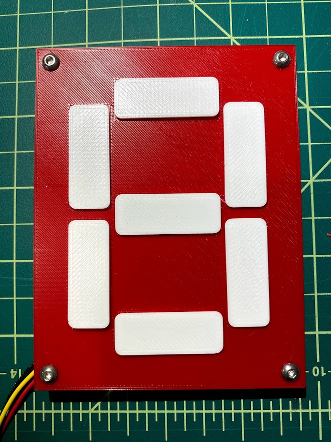
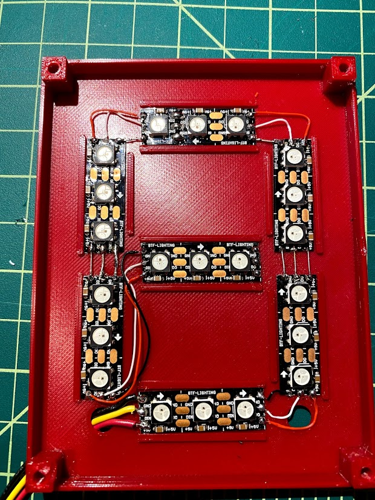

# NeoDigits
7 segment display and arduino library based on neopixel strips and 3D printed housings

## Arduino code
The key component of this repo is the Neodigit.h Arduino library. There is also a simple example using the Adafruit Neopixel library, but the main library depends on [FastLED](http://fastled.io/).

The examples here are made with ws2812 (neopixels) but this library should support any chip supported by FastLED.

## Housings/Fabrication
The examples made here (and whose design/printing files are in the fabricate directory are made using WS2812 addressable strip (100/meter pitch).

### Wiring
For my samples here, I wired the segments in counter clockwise order from the lower right:

>      Segment indices                                                     
>            3                                                             
>           ---                                                            
>        4 |   |  2                                                        
>           -6-                                                            
>        5 |   |  1                                                        
>           ---                                                            
>            0                                                             
If you wish to wire them in a different order, you will have to change the allSegments and maskSegments tables.
These are simply tables of which segments to turn on (or in the case of mask segments, turn off) for each digit.
Unused segments are -1

